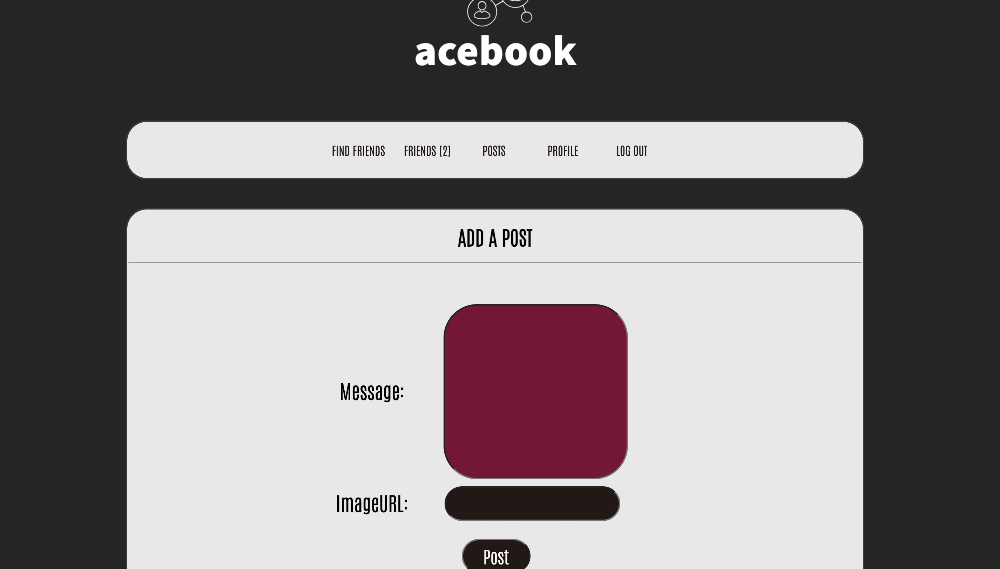
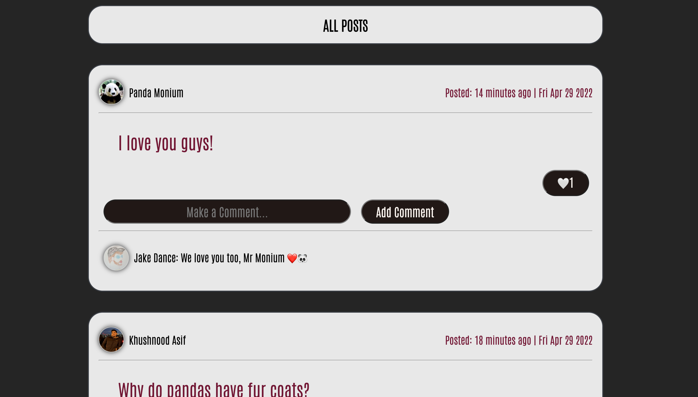
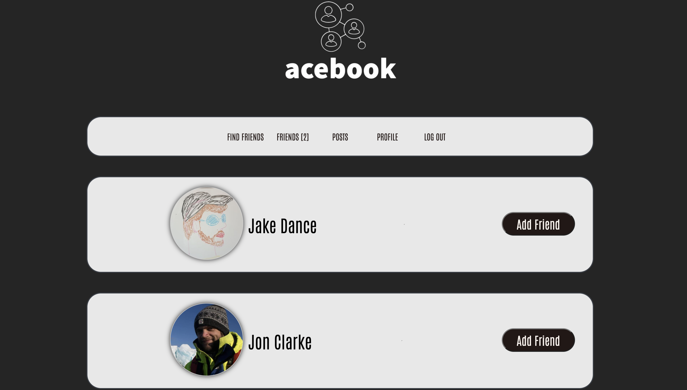
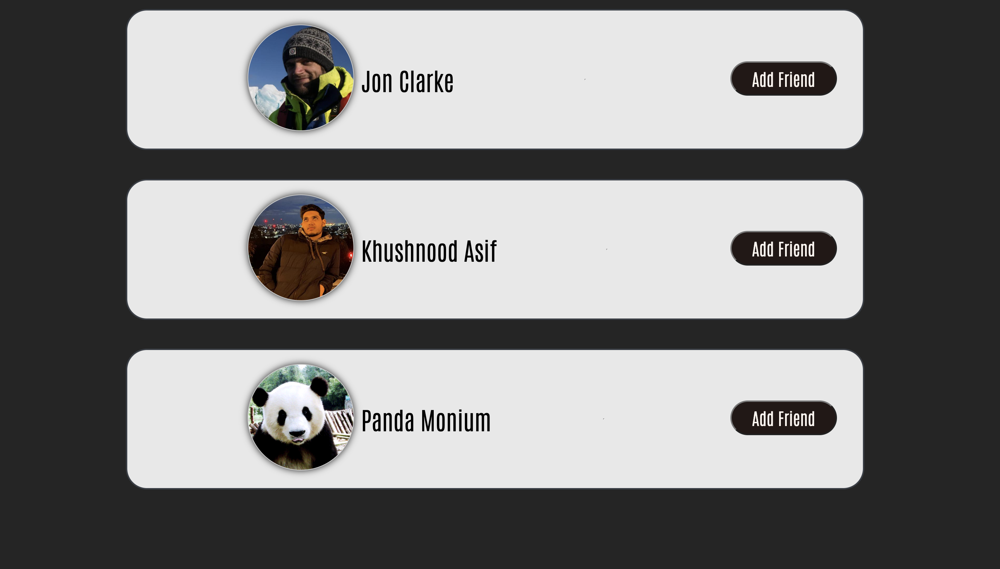
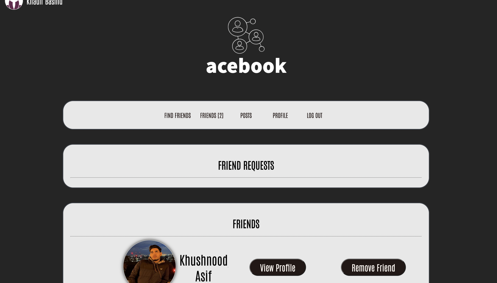
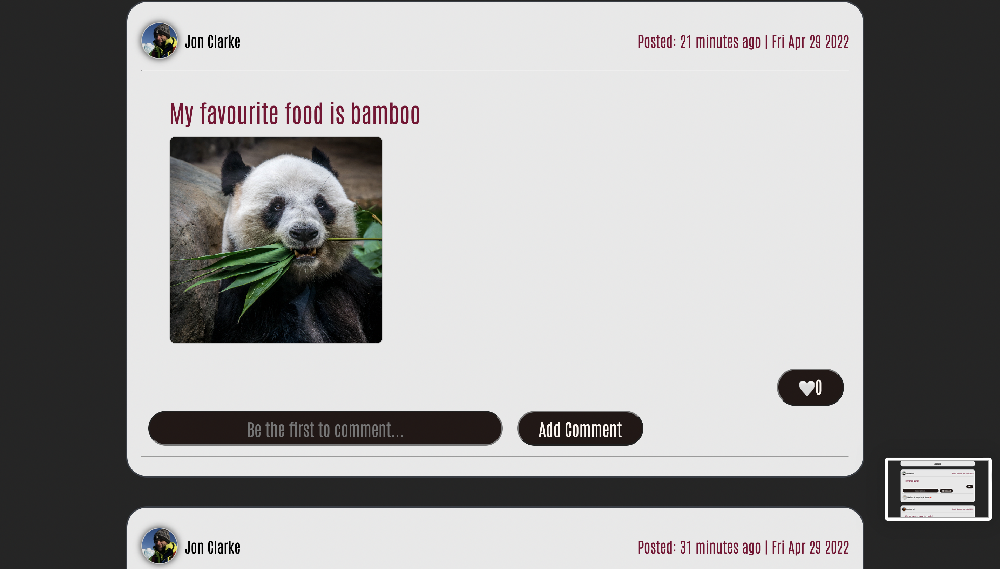
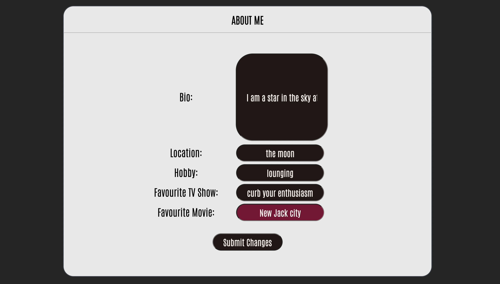

# AceBook

## Checkout the app!

```
https://acebook-makers.herokuapp.com/
```

## Installing Locally

```
$ git clone https://github.com/JonClarke84/acebook-pandas.git
$ cd acebook-pandas
$ npm install
```
## Run Web App

```
$ npm start
```

### Install Node.js

1. Install Node Version Manager (NVM)
   ```
   brew install nvm
   ```
   Then follow the instructions to update your `~/.bash_profile`.
2. Open a new terminal
3. Install the latest long term support (LTS) version of [Node.js](https://nodejs.org/en/), currently `16.14.0`.
   ```
   nvm install 16
   ```
4. Install MongoDB
   ```
   brew tap mongodb/brew
   brew install mongodb-community@4.4
   ```
5. Start MongoDB
   ```
   brew services start mongodb-community@4.4
   ```

### Start

1. Start the server
   ```
   npm start
   ```
2. Browse to [http://localhost:3000](http://localhost:3000)

### Test

- Run all tests
  ```
  npm test
  ```
- Run a check
  ```bash
  npm run lint              # linter only
  npm run test:unit         # unit tests only
  npm run test:integration  # integration tests only
  ```

#### Start test server

The server must be running locally with test configuration for the
integration tests to pass.

```
npm run start:test
```

This starts the server on port `3030` and uses the `acebook_test` MongoDB database,
so that integration tests do not interact with the development server.

## MongoDB Connection Errors?

Some people occasionally experience MongoDB connection errors when running the tests or trying to use the application. Here are some tips which might help resolve such issues.

- Check that MongoDB is installed using `mongo --version`
- Check that it's running using `brew services list`
- Try swapping `localhost`, everywhere that it appears in your codebase, with `127.0.0.1`. It might be surprising but this does sometimes make a difference.

## AceBook Model


## AceBook Web Pages











## User Stories
```
ADD USER STORIES
```
